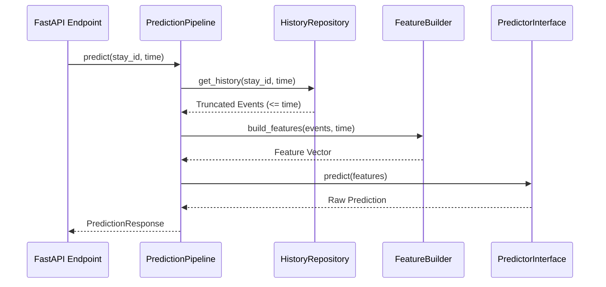

# Pipeline Design

> **WARNING:** The data and logic described in this system are for **development and mock data only**. All data is synthetic. This is **NOT** a clinical tool and does **NOT** use real MIMIC-IV data.

## Pipeline Architecture



## Components
1. **HistoryRepository**: Fetches patient events up to `t`. Responsible for enforcing the temporal leakage boundary.
2. **FeatureBuilder**: Transforms raw historical events into a fixed-length feature vector.
3. **ArtifactLoader**: Loads model configurations, manifests, and weights from disk.
4. **PredictorInterface**: Wraps the underlying ML models (e.g., XGBoost) to expose a unified `predict` method.

## Temporal Leakage Prevention
The core defense against data leakage is in the `HistoryRepository`. When `get_history(stay_id, prediction_time)` is called, the repository filters all events using the strict condition `event_time <= prediction_time`. The `FeatureBuilder` never sees future data.

## Feature Builder Interface
The `FeatureBuilder` is defined as an abstract base class.
The current `MockFeatureBuilder` aggregates event counts and values deterministically.
For MIMIC-IV integration, a `RealFeatureBuilder` will be implemented to handle imputation, scaling, and rolling aggregations.

## Artifact Manifest Design
Located at `artifacts/mock/selected_models_v1.json`, this file dictates which model artifacts to load for which endpoints.
Example format:
```json
{
  "version": "1.0",
  "endpoints": {
    "organ_support_initiation_24h": {
      "model_path": "artifacts/mock/rf_support_v1.pkl",
      "type": "binary"
    }
  }
}
```

## Replacing Mock Components
To integrate with real data and models (Sanskruti's tasks):
1. Implement `MimicHistoryRepository` inheriting from `HistoryRepository`.
2. Implement `MimicFeatureBuilder` implementing the `FeatureBuilder` interface.
3. Implement `XGBoostPredictor` implementing the `PredictorInterface`.
4. Update the dependency injection in `api.main` to use the real components.

## Dashboard Integration
The pipeline returns a standardized `PredictionResponse` Pydantic model. This same schema is serialized to JSON by FastAPI, serving as the direct contract for the dashboard frontend.

## Design Decisions and Rationale
- **Dependency Injection**: Allows easy swapping of mock and real components for testing and phased development.
- **Strict Interfaces**: Ensures that the feature engineering and model inference boundaries are clearly separated.
- **Pydantic Validation**: Guarantees that the pipeline always receives valid inputs and outputs correctly formatted responses.
